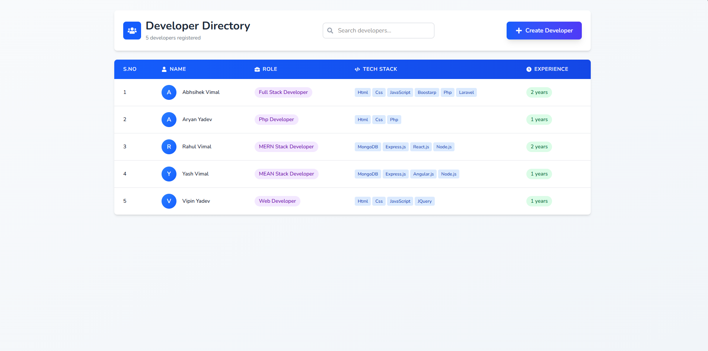

# Developer Directory App

- Frontend demo link : https://create-a-developer-directory-app-ba.vercel.app
- Backend demo link : https://create-a-developer-directory-app-backend.onrender.com

## Features

### Add developer with:
- Full Name
- Role (Frontend / Backend / Full-Stack)
- Tech Stack (comma-separated)
- Experience (in years)
- Description
- Join Date
- Profile Image (Cloudinary upload)
- Edit developer details
- Delete developer
- View full developer profile

### Paginated developer list
- 🔍 Search & Filtering
- Search developers by name or tech stack
- Filter by role (Frontend / Backend / Full-Stack)
- 🎨 Frontend Features
- Built using React (functional components + hooks)
- Styled with Tailwind CSS
- Icons from React Icons
- Toast notifications (success & error)
- Responsive, clean UI/UX
- Pagination support
- Login & Signup pages
- Logout button
- Protected UI routes

### 🛠 Backend Features
- Node.js + Express backend
- Full CRUD API for developers
- MongoDB Atlas as the database
- JWT Authentication (login, protected routes)
- Joi validation middleware for request validation
- Cloudinary for image uploads
- dotenv for environment variables
- CORS enabled
- Clean folder structure (routes, controllers, models)

